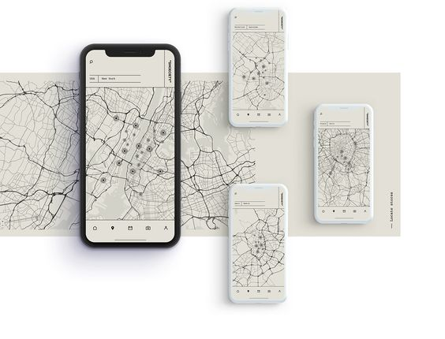

# Vincent Otis Portfolio Website

Vincent Otis Portfolio Website is a showcase of my projects, skills, and experience as a software engineer.

## Table of Contents

- [About](#about)
- [Projects](#projects)
- - [Project 1: Compare Location](#project-1-compare-location)
- - [Project 2: Location App](#project-2-location-app)
- - [Project 3: Web Calculator](#project-3-web-calculator)
- [Skills](#skills)
- [Contact](#contact)

## About

I'm Vincent Otis, a dedicated software engineer based in Nairobi, Kenya. I'm passionate about creating efficient and user-centric applications.

## Projects

### Project 1: Compare Location

- **Description:** A web application that enables users to compare different locations based on various criteria.
- **Demo:** [Live Demo](https://otis-ke.github.io/user_location_compare.github.io/)
- **GitHub:** [Repository](https://github.com/otis-ke/user_location_compare.github.io)

### Project 2: Location App

- **Description:** An application that provides location-based information to users.
- **Demo:** [Live Demo](https://otis-ke.github.io/location_user.github.io/)
- **GitHub:** [Repository](https://github.com/otis-ke/location_user.github.io)

### Project 3: Web Calculator

- **Description:** An online calculator built using web technologies.
- **Demo:** [Live Demo](https://otis-ke.github.io/calculator.github.io/)
- **GitHub:** [Repository](https://github.com/otis-ke/calculator.github.io)

<!-- Add more projects as needed -->

## Skills

- Front-End Development: HTML, CSS, JavaScript
- React.js and React Native
- Node.js and Express.js
- Android Application Development (Java, Kotlin)
- Version Control with Git
- UI/UX Design with Figma

## Contact

Feel free to reach out to me:

- Email: [vincentotiskisia@gmail.com](mailto:vincentotiskisia@gmail.com)
- WhatsApp: [+254769212618](https://api.whatsapp.com/send?phone=254769212618)
- LinkedIn: [Vincent Otis](https://www.linkedin.com/in/vincent-otis-1315b0235)

---

Designed and developed by Vincent Otis.

